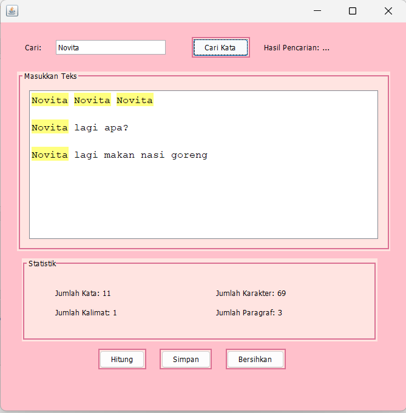

# AplikasiPenghitungkata
 Tugas5_NovitaFitriaRatnawati_2210010228
 
# Aplikasi Penghitung Kata
Aplikasi Penghitung Kata adalah aplikasi untuk menghitung jumlah kata dari kata yang diinput

# Keunggulan Aplikasi
- Penghitung Kata: Aplikasi ini ada jumlah kata, jumlah karakter, jumlah kalimat dan jumlah paragraf. Ada button simpan untuk menyimpan datanya

# Pembuat Aplikasi
 Novita Fitria Ratnawati - 2210010228 - Tugas 5

# Fitur
Aplikasi ini menawarkan fitur:

Penghitung kata dari kata yang diinput

## Cara Menjalankan

1. Run File
2. Ketikkan Kata yang ingin diinput di Text Area
3. Ketikkan salah satu Kata yang ada di Text Area ke Text Field
4. Tekan Button cari kata untuk mencari kata yang ada di text Area
5. Tekan Button Simpan untuk menyimpan ke folder
6. Tekan Button Bersihkan jika ingin mengulang kata yang ada di Text Area

# Demo
